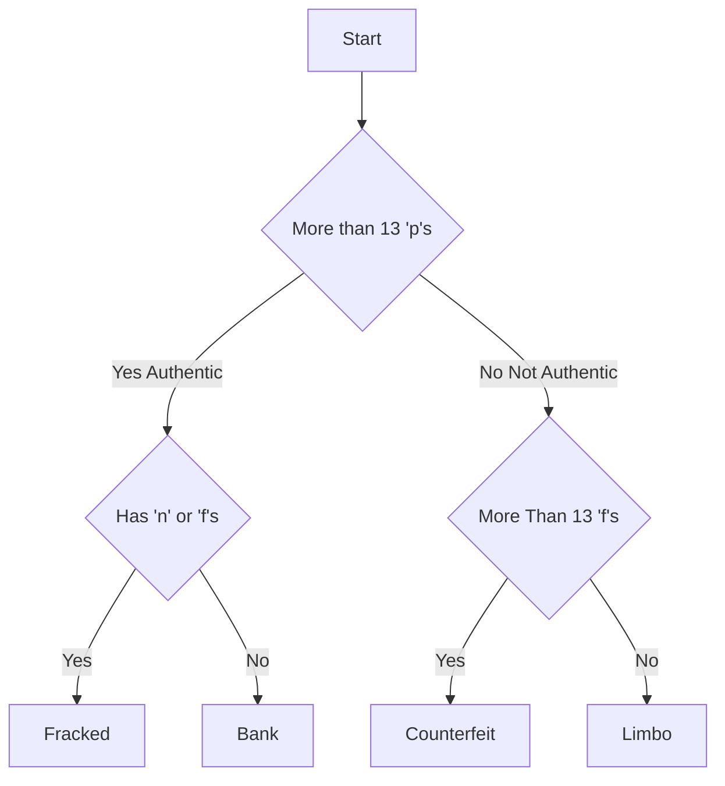

# Syncs the Coins in the RAIDA. 

# Blockchain
There is a blockchain that stores 

Each RAIDA has a CloudCoin that gives it access. 

Blockchain has the following data: 

Coin Denomination, Serial Number, RAIDA (0-24), RAIDA ARRAY ID, DNS Domain that the RAIDA That the coins is on, zero proof thing, number of affermations, Time Created, Reason Created.

Rules: 
* IP addresses can only be used once (RAIDA cannot be on the same machine)
* Coins can only exist once. 
* Zero Knowledge Trusts must be implemented.

## Clients create the blocks
1. Client wants to create new coins:
   * By Conversion
   * By Making Change
   * By Joining Coins

### Conversion
1. Client sends coins to be converteted
3. Sends calls the GET TICKET TRANACTION servies which includes the client sending a 16 byte transaction number.
4. RAIDA checks to see if the coins exist on it. Responds with a ticket
6. Client decides which RAIDA will be the Master Block Coordinator.
7. Sends the tickets, transaction number, master block coordintor to ALL RAIDA.
8. All RAIDA check with other RAIDA. If they are good they will take the advice from the Master Block Coordinator.
9. All RAIDA change their Blockchains to what the Block Master says. 


### By Making Change
Client sends coins to make change and gets them back. After downloading coins,client must get tickets and call the register new coins service
1. Client Gets change, 
3. Sends calls the GET TICKET TRANACTION servies which includes the client sending a 16 byte transaction number.
4. RAIDA checks to see if the coins exist on it. Responds with a ticket
6. Client decides which RAIDA will be the Master Block Coordinator.
7. Sends the tickets, transaction number, master block coordintor to ALL RAIDA.
8. All RAIDA check with other RAIDA. If they are good they will take the advice from the Master Block Coordinator.
9. All RAIDA change their Blockchains to what the Block Master says. 

### By Joining Denominations
Client sends coins to make change and gets them back. After downloading coins,client must get tickets and call the register new coins service
1. Client sends coins to be converteted
3. Sends calls the GET TICKET TRANACTION servies which includes the client sending a 16 byte transaction number.
4. RAIDA checks to see if the coins exist on it. Responds with a ticket
6. Client decides which RAIDA will be the Master Block Coordinator.
7. Sends the tickets, transaction number, master block coordintor to ALL RAIDA.
8. All RAIDA check with other RAIDA. If they are good they will take the advice from the Master Block Coordinator.
9. All RAIDA change their Blockchains to what the Block Master says. 

RAIDA Checks their own records to see if the coin exists. If not, RAIDA does nothing. If yes, the RAIDA will add the coins to the blockchain. The only difference is the RAIDA ID (0-24).

RAIDA broadcasts to the other RAIDA that it is adding the coin.
RAIDA Receive broadcasts that they are adding the coin to their nodes. 
These all follow the exact form and all RAIDA can then add the block to their blockchains and the hash should be the same. 
If there are not thirteen exact same blocks then no block is created and those coins are not added.


RAIDAs can scan the blockchain to see if they are missing coins or need to delete them. 

Client adds coin location info to the coin. 


RAIDA Call tickets and see if they are real. If enough answer, the 


Root RAIDA
* Only the root RAIDA can create new coins. 
* The exchange exists on the Root RAIDA only
* Lockers can only contain coins from the same RAIDA. 


Each RAIDA can make changes to the blockchain. 

When a coin is created by a RAIDA, it will add it to the blockchain. 
These new coins will have a timestamp on them.
The coins will be added to a block and the block added to the blockchain.
New coins cannot be spend for few minutes while the network converges.
The blockchains will look at the new block and see if the added coins match what they have. If yes, they adopt the new Block. If not they reject it. 



  


# Direct RAIDA style

I am thinking of a faster way to sync the RAIDA's serial numbers. 

I am not sure how we synchronize now so if you have that documented, let me know .

The idea is to make it so the calling RAIDA has to send more data than the responding RAIDA needs to return. This would guard against DDOS attacks. 

Here is how it would work:
# The RAIDA that wants to sync will send a request to other RAIDA and this request contains the same type of information as the Hash PANG. It will have ranges and singles. The request would also specify the denomination and the starting and ending serial numbers. 

# The responding RAIDA would look up all the Serial numbers that fall within the range specified and compare what the caller sent. 

# The responding RAIDA would respond with an "Add list" and a "Delete" list. They would also use ranges and singles. I will write it up and show you. 

Example with three ranges and three coins:
```hex
CH CH CH CH CH CH CH CH CH CH CH CH CH CH CH CH
DN // The Denomonation of the request. There can only be one .
ST ST ST ST // Starting Serial Number (inclusive)
ED ED ED ED  // Ending Serial Number (incluseive)
NR  
RS RS RS RS RE RE RE RE // Starting sd, ending sn (inclusive)
RS RS RS RS RE RE RE RE 
RS RS RS RS RE RE RE RE 
SN SN SN SN  //Singles
SN SN SN SN
SN SN SN SN
3E 3E 
```
Response: 
```hex
CH CH CH CH CH CH CH CH CH CH CH CH CH CH CH CH
DN // The Denomonation of the request. There can only be one .
ST ST ST ST // Starting Serial Number (inclusive)
ED ED ED ED  // Ending Serial Number (incluseive)
00 00 00 00 00 00 00 00 00 00 00 00 00 00 00 // Zeros show the start of the delete list
NR  // Number of ranges. 
NS // number of singes
RS RS RS RS RE RE RE RE // Starting sd, ending sn (inclusive)
RS RS RS RS RE RE RE RE 
RS RS RS RS RE RE RE RE 
SN SN SN SN  //Singles
SN SN SN SN
SN SN SN SN
11 11 11 11 11 11 11 11 11 11 11 11 11 11 11 11 //Start of Add list
NR  
NS
RS RS RS RS RE RE RE RE // Starting sd, ending sn (inclusive)
RS RS RS RS RE RE RE RE 
RS RS RS RS RE RE RE RE 
SN SN SN SN  //Singles
SN SN SN SN
SN SN SN SN
3E 3E 
```
